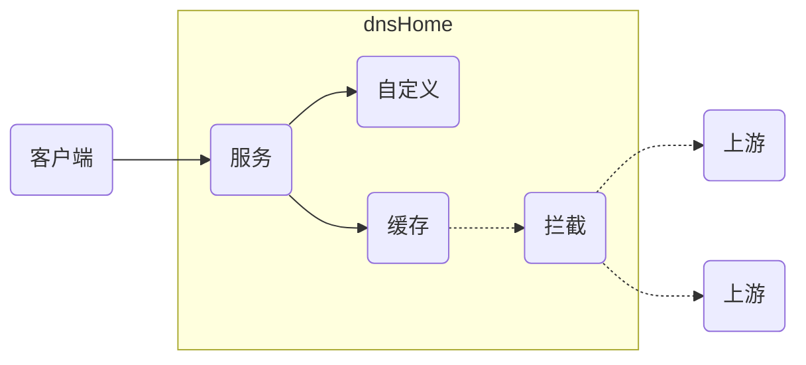

<h2 align="center">屏蔽全网广告和跟踪的免费、高速、安全 DNS 服务器</h2>
<br/>
<p align="center"><a href="https://github.com/dnsHome/dnsHome/releases"></a>
</p>



## **1. 安装运行**

### **（1）OpenWrt**
- 创建运行目录 ` mkdir -p /dnsHome ` ，以 ` /dnsHome ` 为例。
- 进入运行目录 ` cd /dnsHome ` 。
- 下载设备匹配的运行版本，以 x64 ` dnsHome_linux_amd64.tar.gz ` 为例， ` wget -O dnsHome.tar.gz -q https://github.com/dnsHome/dnsHome/releases/download/v0.0.1/dnsHome_linux_amd64.tar.gz ` 。
- 解压 ` tar -xzf dnsHome.tar.gz ` 。
- 为应用程序赋予运行权限 ` chmod +x ./dnsHome ` 。
- 修改配置文件 ` vi app.toml ` ，详见 ` 2. 配置文件说明 ` 。
- （可选）根据需要直接运行 ` ./dnsHome ` 。
- 服务方式运行：
  * ` cd /etc/init.d `
  * ` vi dnsHome `
  * 输入以下内容
      ```
      #!/bin/sh /etc/rc.common

      START=21
      STOP=80
      USE_PROCD=1

      start_service() {
        procd_open_instance
        procd_set_param command "/dnsHome/dnsHome"
        procd_set_param respawn
        procd_close_instance
      }

      service_triggers() {
        procd_add_interface_trigger "interface.*" lan /etc/init.d/dnsHome restart
      }
      ```
  * 按 esc 键，在 ` : ` 提示符后面输入 ` wq ` ，按回车键保存退出。
  * ` service dnsHome enable ` 启用服务自动运行
  * ` service dnsHome disable ` 禁用服务自动运行
  * ` service dnsHome start ` 开始运行服务
  * ` service dnsHome stop ` 停止运行服务
  * ` service dnsHome status ` 查看服务状态

> [!TIP]
> 请释放 dnsmasq 占用的 53 端口，将其 server port 改为 5353 或其他端口。

> [!TIP]
> 如果日志中的时间为 UTC 时间，非北京时间，请安装时区依赖。
> - opkg update
> - opkg install zoneinfo-asia
> - cp /usr/share/zoneinfo/Asia/Shanghai /etc/localtime
> - opkg remove zoneinfo-asia
> - 确认 System Timezone 已设为 Asia/Shanghai


### **（2）Alpine Linux**
- 创建运行目录 ` mkdir -p /dnsHome ` ，以 ` /dnsHome ` 为例。
- 进入运行目录 ` cd /dnsHome ` 。
- 下载设备匹配的运行版本，以 x64 ` dnsHome_linux_amd64.tar.gz ` 为例， ` wget -O dnsHome.tar.gz -q https://github.com/dnsHome/dnsHome/releases/download/v0.0.1/dnsHome_linux_amd64.tar.gz ` 。
- 解压 ` tar -xzf dnsHome.tar.gz ` 。
- 为应用程序赋予运行权限 ` chmod +x ./dnsHome ` 。
- 修改配置文件 ` vi app.toml ` ，详见 ` 2. 配置文件说明 ` 。
- （可选）根据需要直接运行 ` ./dnsHome ` 。
- 服务方式运行：
  * ` cd /etc/init.d `
  * ` vi dnsHome `
  * 输入以下内容
      ```
      #!/sbin/openrc-run
      command="/dnsHome/dnsHome"
      command_background=true
      pidfile="/run/${RC_SVCNAME}.pid"
      ```
  * 按 esc 键，在 ` : ` 提示符后面输入 ` wq ` ，按回车键保存退出。
  * 为服务定义赋予运行权限 ` chmod +x ./dnsHome ` 。
  * ` rc-update add dnsHome default ` 添加服务自动运行
  * ` rc-update del dnsHome ` 删除服务自动运行
  * ` service dnsHome start ` 开始运行服务
  * ` service dnsHome stop ` 停止运行服务
  * ` service dnsHome status ` 查看服务状态

> [!TIP]
> 如果日志中的时间为 UTC 时间，非北京时间，请安装时区依赖。
> - apk update
> - apk add tzdata
> - cp /usr/share/zoneinfo/Asia/Shanghai /etc/localtime
> - echo "Asia/Shanghai" > /etc/timezone
> - apk del tzdata

### **（3）Debian Linux**
- 创建运行目录 ` mkdir -p /dnsHome ` ，以 ` /dnsHome ` 为例。
- 进入运行目录 ` cd /dnsHome ` 。
- 下载设备匹配的运行版本，以 x64 ` dnsHome_linux_amd64.tar.gz ` 为例， ` wget -O dnsHome.tar.gz -q https://github.com/dnsHome/dnsHome/releases/download/v0.0.1/dnsHome_linux_amd64.tar.gz ` 。
- 解压 ` tar -xzf dnsHome.tar.gz ` 。
- 赋予运行权限 ` chmod +x ./dnsHome ` 。
- 修改配置文件 ` vi app.toml ` ，详见 ` 2. 配置文件说明 ` 。
- （可选）根据需要直接运行 ` ./dnsHome ` 。
- 服务方式运行：
  * ` cd /lib/systemd/system `
  * ` vi dnsHome.service ` ，输入以下内容；按 esc 键，在 ` : ` 提示符后面输入 ` wq ` ，按回车键保存退出。
      ```[Unit]
      Description=dnsHome
      ConditionFileIsExecutable=/dnsHome/dnsHome
      After=network-online.target 

      [Service]
      WorkingDirectory=/dnsHome/
      ExecStart=/dnsHome/dnsHome
      Restart=always
      RestartSec=5
      KillSignal=SIGINT
      SyslogIdentifier=dnsHome
      User=root

      [Install]
      WantedBy=multi-user.target
      ```
  * ` systemctl daemon-reload ` 刷新服务列表。
  * ` systemctl enable dnsHome ` 启用服务自动运行
  * ` systemctl disable dnsHome ` 禁用服务自动运行
  * ` systemctl start dnsHome ` 开始运行服务
  * ` systemctl stop dnsHome ` 停止运行服务
  * ` systemctl status dnsHome ` 查看服务状态

> [!TIP]
> 请释放 systemd-resolved 占用的 53 端口。
> - vi /etc/systemd/resolved.conf
> - DNSStubListener=no
> - 按 esc 键，在 : 提示符后面输入 wq ，按回车键保存退出
> - systemctl reload-or-restart systemd-resolved

> [!TIP]
> 如果日志中的时间为 UTC 时间，非北京时间，请设置时区。
> - dpkg-reconfigure tzdata
> - 选择 Asia/Shanghai

### **（4）Windows**
- 创建运行目录，以 ` C:\dnsHome ` 为例。
- 下载设备匹配的运行版本，以 x64 ` dnsHome_windows_amd64.zip ` 为例，解压到上述运行目录。
- 修改配置文件 ` app.toml ` ，详见 ` 2. 配置文件说明 ` 。
- （可选）根据需要直接运行 ` dnsHome.exe ` 。
- 在 ` 开始 ` 菜单 ` Windows 管理工具 ` 中，打开 ` 任务计划程序 ` 。
- 点击 ` 创建任务 ` ，
  * 输入名称 ` dnsHome ` ，
  * 选择 ` 不管用户是否登录都要运行 ` 。
- 触发器页签，点击 ` 新建 ` ；
  *  ` 开始任务 ` 选择 ` 启动时 ` ；
  * （可选）根据需要设置 ` 延迟任务时间 ` ，实现 windows 启动一段时间后运行的效果。
- 操作页签，点击 ` 新建 ` ；
  *  ` 操作 ` 选择 ` 启动程序 ` ；
  *  ` 程序或脚本 ` 为应用全路径，如： ` C:\dnsHome\dnsHome.exe ` ；
  *  ` 起始于 ` 为应用所在文件夹，如： ` C:\dnsHome ` 。
- 条件页签，
  * （可选）根据需要，去除 ` 只有在计算机使用交流电源时才启动此任务 ` 选项。
- 设置页签，
  * （可选）根据需要，去除 ` 如果任务运行时间超过以下时间，停止任务 ` 选项。
- 点击 ` 确定 ` ，输入用户名和密码，保存任务。

## **2. app.toml 配置文件说明**
### **（1）样例**
采用 TOML 格式，如下所示：
```
[dns]
bind = ["127.0.0.1", "A.B.C.D"]
upstream = [
  # 360dns
  "https://123.125.81.6/dns-query",
  # alidns
  "https://223.6.6.6/dns-query",
  # github
  "/github.com/64.6.64.6", "/github.com/104.155.237.225",
  "/githubusercontent.com/64.6.64.6", "/githubusercontent.com/104.155.237.225",
  # ptr
  "/ptr/A.B.C.D"
]
cache-timeout = 300
rule = ["/dns/filter.txt", "https://adrules.top/dns.txt"]
rule-timeout = 3600
host-a = ["name.domain.lan/A.B.C.D"]
host-aaaa = ["name.domain.lan/A:B:C:D:E:F:G:H"]
host-cname = ["name.domain.lan/cname.domain.lan"]
host-mx = ["domain.lan/10 mx.domain.lan"]

[log]
client = false
upstream = false
```
### **（2）dns 配置节**
- **bind**：用 ` 英文逗号 ` 分隔的多个本地绑定信息。
  * 建议首选 ` 默认 udp 协议、默认 53 端口 ` 方式。
  * 示例：
    + ` 127.0.0.1 ` ：默认 ` udp ` 协议、默认 ` 53 ` 端口；
    + ` 127.0.0.1:53 ` ：默认 ` udp ` 协议、指定 ` 53 ` 端口；
    + ` udp://127.0.0.1 ` ：指定 ` udp ` 协议、默认 ` 53 ` 端口；
    + ` udp://127.0.0.1:53 ` ：指定 ` udp ` 协议、指定 ` 53 ` 端口；
    + ` tcp://127.0.0.1 ` ：指定 ` tcp ` 协议、默认 ` 53 ` 端口；
    + ` tcp://127.0.0.1:53 ` ：指定 ` tcp ` 协议、指定 ` 53 ` 端口。

- **upstream**：用 ` 英文逗号 ` 分隔的多个上游服务信息。
  * 建议首选 ` DoH ( DNS-over-HTTPS ) ` 方式。
  * 互联网上游服务一般 2 个即可，避免单点故障的同时，减少并发请求的等待时间。
    + 采用 IP 地址可降低域名解析在多个运营商网络切换带来的性能波动。
  * 示例：
    + ` A.B.C.D ` ：默认 ` udp ` 协议、默认 ` 53 ` 端口；
    + ` A.B.C.D:53 ` ：默认 ` udp ` 协议、指定 ` 53 ` 端口；
    + ` udp://A.B.C.D ` ：指定 ` udp ` 协议、默认 ` 53 ` 端口；
    + ` udp://A.B.C.D:53 ` ：指定 ` udp ` 协议、指定 ` 53 ` 端口；
    + ` tcp://A.B.C.D ` ：指定 ` tcp ` 协议、默认 ` 53 ` 端口；
    + ` tcp://A.B.C.D:53 ` ：指定 ` tcp ` 协议、指定 ` 53 ` 端口；
    + ` https://A.B.C.D/dns-query ` ：加密 DoH ( DNS-over-HTTPS )；
    + ` /domain.lan/A.B.C.D ` ：为 ` domain.lan ` 域名及其子域名，指定 ` A.B.C.D ` 上游服务信息；
    + ` /ptr/A.B.C.D ` ：（可选）为 ` PTR ` 类型指定 ` A.B.C.D ` 上游服务信息；无此配置默认返回 IP 地址。

- **cache-timeout**：上游结果在缓存中的有效期；有效期内直接返回缓存结果。

- **rule**：用 ` 英文逗号 ` 分隔的多个拦截广告和跟踪定义的 URL 信息。
  * 支持 A 和 AAAA 类型；拦截 A 类型，返回 ` 0.0.0.0 `；拦截 AAAA 类型，返回 ` :: `。
  * 示例：
    + ` /REGEX/ ` ：拦截与 REGEX 正则表达式匹配的域名；
    + ` ||domain.xxx^ ` ：拦截 domain.xxx 及其所有子域名；
    + ` ||*.domain.xxx^ ` ：拦截 domain.xxx 所有子域名，不含 domain.xxx 域名；
    + ` @@||white.domain.xxx^ ` ：放行 white.domain.xxx 域名；

- **rule-timeout**：上述拦截定义的有效期；超过有效期重新下载拦截定义。

- **host-a**：用 ` 英文逗号 ` 分隔的多个自定义 A 记录。
  * 示例：` /domain.lan/A.B.C.D ` ：将 ` domain.lan ` 解析为 ` A.B.C.D ` 。

- **host-aaaa**：用 ` 英文逗号 ` 分隔的多个自定义 AAAA 记录。
  * 示例：` /domain.lan/A:B:C:D:E:F:G:H ` ：将 ` domain.lan ` 解析为 ` A:B:C:D:E:F:G:H ` 。

- **host-cname**：用 ` 英文逗号 ` 分隔的多个自定义 CName 记录。
  * 示例：` /domain.lan/cname.domain.lan ` ：将 ` domain.lan ` 解析为 ` cname.domain.lan ` 。

- **host-mx**：用 ` 英文逗号 ` 分隔的多个自定义 MX 记录。
  * 示例：` /domain.lan/10 mx.domain.lan ` ：将 ` domain.lan ` 解析为 ` mx.domain.lan ` ，优先级为 ` 10 ` 。

### **（3）log 配置节**
- **client**：为 true 时记录客户端请求日志；为 false 时不记录日志；在 log 目录下名为 ` 日期 + C.log ` 文件。
- **upstream**：为 true 时记录上游服务请求日志；为 false 时不记录日志；在 log 目录下名为 ` 日期 + U.log ` 文件。

## **3. 验证 DNS 响应**

- 在 windows 命令行中可输入 ` nslookup -q=A github.com A.B.C.D ` 。
- 在 linux 命令行中可输入 ` dig A github.com @A.B.C.D ` 。

## **4. 赞助**
<div align="center"></div>
<div align="center">支付宝微信</div>